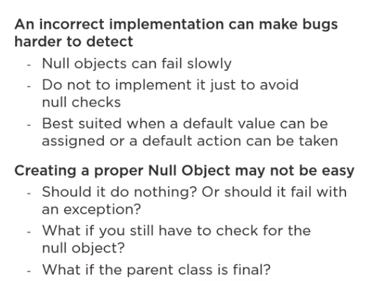

# Working with Nulls in Java
**Null** is a value that indicates that a reference does not refer to an object

## Best Practices for Data That "You" Don't Control
**Guiding Principles**
- Document your public API
- Fail Fast
- Be explicit - Try to make the intent of why some value cannot be `null` as clear as possible 

Data that cannot be controlled properly is the date from the entry points of the application.

1. Always validate parameter
- At the beginning of the method, respecting the principle of **Fail Fast**;
2. Throw an Exception (NullPointerException or IllegalArgumentException), If the input of a method that requires non-null values receive null;
3. As an alternative for the 2 point, the null can be replaced by a default value;

## Best Practices for Data That "You" Control
- No need to check for null in every method
	- Never pass null as an argument
		- Use primitives instead of wrapper classes
		- for optional parameters, overloading the methid with different sets of parameter is an alternative
	- Never return null
		- Return empty collections
		- Null Object Pattern
		- Optional Type

## Checking For Null Using Annotations
### Spring Annotations
The package `org.springframework.lang` defines the following annotations 
- `@NonNull` - Defines that a parameter or a return value cannot be null 
- `@Nullable` - Indicates that a element can be null
- `@NonNullApi` - Declares as **NonNull** the default behavior for parameters and return values
- `@NonNullFields` - Declares as **NonNull** the default behavior for fields.

- @Validated - Use it in the class level. If there is a constraint violation an CanstraintViolationException will be thrown 
#### Declaring all Methods of a Repository Interface as `@NonNullApi`

**File Structure**
- repository
	- BookRepository.java
	- *package-info.java*

**package-info.java**
```java
@org.springframework.lang.NonNullApi
package com.my.package.repository
```

### Bean Validation Annotations - Hibernate Validator

**FAQ**
1. Does hibernate Validator only validate objects of the domain model?
R: No, it validates objects in all layers
2. Are `@NotNull` and @Column(nullable=false), equivalent?
R: No, @Column is part of the JPA specification. If hibernates creates te table, it adds a **not null** constraint to the database column and the validatio is made by the database. By the other hand, @NotNull is part of the bean validation specification and performs its validations at the application level.

- `@NotNull` - Used in Fields and Method's parameters
- `@Valid` - `public void myFunction(@valid BookDTO book){...}`

PS: If the an Hibernate Entity (@Entity) class has some bean validation annotations, so the validation of this annotations will be trigged when the **EntityManager** is *flushed*


### Lombok Annotations
- `@NotNull` - Annotation for parameters of methods and constructors
	- if @Data is used, so this annotation will add validation for the constructor and setters

## Null Object Design Pattern

### Concerns about the usage of Null Objects Design Pattern

