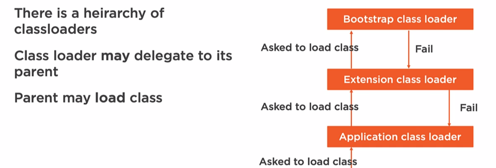
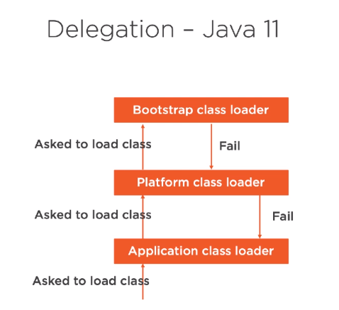

# Java - JVM Class Loading and Reflection

`java -cp out\production\Client;out\artifacts\Interfaces_jar\Interfaces.jar`

how to create a jar file: `jar cvf helper.jar com.example.Helper.class`

## Classloading - Java 8

- Core classes: They are loaded as part of the standard java

- Extension classes: They do not necessarily ship along with the Runtime, but may be used as they were runtime classes.  

- Delegation: It is how class loading works in Java. There is a hierarchy of class loaders.

- Displaying the delegation: Provides information about the class loaders such as their names, where they are trying to load their classes from.

### rt.jar
Java 8 has the jar `rt.jar` that contains all of the compiled class files for the base Java Runtime environment.

### Delegation - Java 8
Java class loaders support delegation model when it comes to loading classes. Typically in applications, there is more than one classloader. For example, there is the classloader that has to load the Extension classes and the classloader that needs to loads the base classes.

- There is a hierarchy of classloaders 
- each of these classloaders has a parent
- a classloader may delegate to its parent the job to load a class 
	- Usually, it the behavior (build-in class loaders), however when a custom class loader is made it may not delegate for its parent to execute loadings (you set the behavior if it will call the parent or not)
- The parent may load the class - when a classloader delegates to its parent to load a class, the parent **may** load a class. When a parent class loads a class, in the future it needs to keep loading this same class, and, typically, when a class is loaded the classloader loads a class once. 

**Example 1 - Loading a basic java console application (FLOW)**

-> Formely **Application classloader is loaded** whose job is to load the classes from the **classpath**.
	-	-> Secondly **Extension classloader is loaded** . It **load classes that are an extension of the standard core Java classes.**
	-	-	-> Finally **Boostrap classloader is loaded** (it is written in C, and **is the parent of all the others.**)	

**Example 1 - Flow**
JVM -> asks  to Application Classloader to load a class
 ---> asks to Extension Classloader 	to load a class
 ----->  asks to Boostrap classloader to load a class  

If boostrap does not find it will fail and return the request to the Extension Classloader, that now will try to locate the class, if it fails then will return the request to load the class for Application Classloader (if fails an exception NoClassDefFoundError will be thrown)



**Example 2 -  Code**

```java
import java.net.*;  
  
public class Delegation {  
  
    public static void main(String[] args) {  
  
       URLClassLoader classLoader = (URLClassLoader) ClassLoader.getSystemClassLoader();  
	   do {  
	      System.out.println("ClassLoader:"  + classLoader);  
	      for(URL  url  :  classLoader.getURLs()) {
			System.out.printf("\t %s\n", url.getPath());
		  }
	   } while ((classLoader = (URLClassLoader) classLoader.getParent()) != null);  
	  
	  System.out.println("Bootstrap ClassLoader");  
  }   
}
```
**Output**
```
//start
ClassLoader:sun.misc.Launcher$AppClassLoader@2a139a55
         /C:/Users/AsusAugusto/Documents/Java-Studies/Java-JVM-Class-Loading-and-Reflection/classes/
ClassLoader:sun.misc.Launcher$ExtClassLoader@42a57993
         /C:/Program%20Files/Java/jre1.8.0_181/lib/ext/access-bridge-64.jar
         /C:/Program%20Files/Java/jre1.8.0_181/lib/ext/cldrdata.jar
         /C:/Program%20Files/Java/jre1.8.0_181/lib/ext/dnsns.jar
         /C:/Program%20Files/Java/jre1.8.0_181/lib/ext/dns_sd.jar
         /C:/Program%20Files/Java/jre1.8.0_181/lib/ext/jaccess.jar
         /C:/Program%20Files/Java/jre1.8.0_181/lib/ext/jfxrt.jar
         /C:/Program%20Files/Java/jre1.8.0_181/lib/ext/localedata.jar
         /C:/Program%20Files/Java/jre1.8.0_181/lib/ext/nashorn.jar
         /C:/Program%20Files/Java/jre1.8.0_181/lib/ext/sunec.jar
         /C:/Program%20Files/Java/jre1.8.0_181/lib/ext/sunjce_provider.jar
         /C:/Program%20Files/Java/jre1.8.0_181/lib/ext/sunmscapi.jar
         /C:/Program%20Files/Java/jre1.8.0_181/lib/ext/sunpkcs11.jar
         /C:/Program%20Files/Java/jre1.8.0_181/lib/ext/zipfs.jar
Bootstrap ClassLoader
Bootstrap ClassLoader
//end
```

## Classloading - Java 11

- Core classes: Now they are modular;

- ~~Extension classes: They do not necessarily ship along with the Runtime, but may be used as they were runtime classes;~~  
- Platform classes: Replaces Extension classes;

- Delegation: (different from java 8) It is how class loading works in Java. There is a hierarchy of class loaders.

- Displaying the delegation: (different from java 8) Provides information about the class loaders such as their names, where they are trying to load their classes from.

**WARNING! ** If you try to override some class from the core classes. In java 11 it will show a compilation error. This error indicates that there is more than one module with the same class.

### Modules over rt.jar
In Java 11  the jar `rt.jar` was replaced by java modules (e.g. `java.sql.jmod`

### Delegation - Java 8

**Example 1 - Loading a basic java console application (FLOW)**

-> Formely **Application classloader is loaded** whose job is to load the classes from the **classpath**.
	-	-> Secondly **Platform classloader is loaded** .
	-	-	-> Finally **Boostrap classloader is loaded** (it is written in C)	



**Example I - Code**

```java
import java.net.*;  
  
public class Delegation {  
  
    public static void main(String[] args) {  
  
       ClassLoader classLoader = ClassLoader.getSystemClassLoader();  
	   do {  
	      System.out.println("ClassLoader:"  + classLoader);  
	      for(URL  url  :  classLoader.getURLs()) {
			System.out.printf("\t %s\n", url.getPath());
		  }
	   } while ((classLoader = classLoader.getParent()) != null);  
	  
	  System.out.println("Bootstrap ClassLoader");  
  }   
}
```

## Custom ClassLoader

To create a custom class loader, we will create a class that will extend ClassLoader. There is a method findClass() that must be overridden.

- if using your own classloader
	- cannot reference implementation in the code
	- this will cause the class to be loaded with the app class loader

**Solving above problem**
- Split code into implementation and interface
	- Interface definitions go on the classpath
	- Implementation is loaded by our classloader 

```
.
+-- Client
|   +-- Main.java
|	+-- CustomClassLoader.class
+-- Implementations
|   +-- com.bueno.aug
|   |	+ -- Quote.java
+-- Interfaces
|   +-- com.bueno.aug
|   |	+ -- IQuote.java
```

**Main.java**
```java
// inside a main method
CustomClassLoader cl = new CustomClassLoader();  
Class clazz = cl.findClass("com.bueno.aug.Quote");  
IQuote quote = (IQuote) clazz.getDeclaredConstructor().newInstance();  
System.out.println(quote.getQuote());
```

**CustomClassLoader.java**
```java
  
public class CustomClassDemo extends ClassLoader {  
    @Override  
  public Class<?> findClass(String name) {  
        byte[] bt = loadClassData(name);  
 return defineClass(name, bt, 0, bt.length);  
  }  
    private byte[] loadClassData(String className) {  
        //read class  
  InputStream is = getClass().getClassLoader().getResourceAsStream(className.replace(".", "/")+".class");  
  ByteArrayOutputStream byteSt = new ByteArrayOutputStream();  
  //write into byte  
  int len =0;  
 try {  
            while((len=is.read())!=-1){  
                byteSt.write(len);  
  }  
        } catch (IOException e) {  
            e.printStackTrace();  
  }  
        //convert into byte array  
  return byteSt.toByteArray();  
  }  
  
}
```

**Quote.java**
```java
public class Quote implements IQuote  {  
    @Override  
  public String getQuote() {  
        return "A rolling stone gathers no moss!!!";  
  }  
}
```

**IQuote.java**
```java
public interface IQuote{  
    String getQuote();  
}
```

## Side By Side Deployment 
- loading different versions of the same class change the location of the searching area of the class loader
- This different versions can coexist

### Loading classes from multiple locations

```java
ClassLoader ucl =  new URLClassLoader(...);

//loading classes from the class name
Class.forName("aug.bueno.Test",true, ucl); //(classname, ,classloader)
```

```java
// "location": "file:///../out/artifacts/implementations_jar/aug_implementations.jar"
URL url = new URL(location);  
URLClassLoader ucl = new URLClassLoader(new URL[]{url});  

Class<ICameraFactory> cls = (Class<ICameraFactory>) Class.forName(configuration.getFactoryType(), true, ucl);
```

In the above code, the class is loaded by the classloader in the  3 parameter.


~~## Hot Deployment
Hot deployment is the re-deployment of changed classes. Differently from the **side by side deployment**, in hot deployment what makes a class to be reloaded is not the presence of other versions of this class in different locations, but an update of the running instance when some change is made. So hot deployment can stay up even though we change some classes instances.~~
