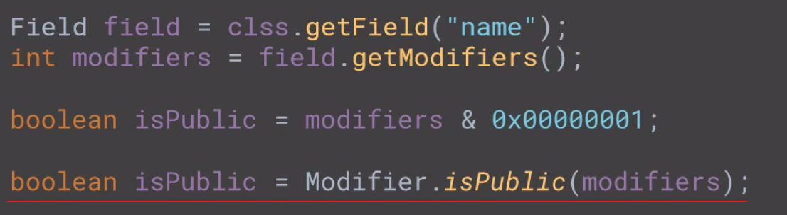

# Java - Reflection API and Method Handles

Each of those classes provides a model for a fundamental element of a class

## The Class named `Class`

### how is it possible to get a reference to a class instance?
There are three patterns to get a `Class` instance
1. Getting a class instance using the `Object.getClass()` method
```java
String name = "Augusto Calado"
Class nameClass = name.getClass();

String address = "Streat Adans Plummer,42 - NY"
Class addressName = address.getClass();

// The same Class object reference will be return if we try to get the class of a object that is the same class of other object which class was get previusly using .getClass();

// addressName and nameClass share the same reference 
```

2. Getting a class instance from the name of the Class
```java 
Class<?> stringClass = String.class;
```

3.  The `Class.forName(className)` from Java Reflection API
```java 
String className = "some data here";
Class<?> classNameObject = Class.forName(className);
```

### Getting the Super class or Intercaces implemented any
```java
String className = "some data here";
Class<?> clss = Class.forName(className);

Class<?> superClass = clss.getSuperClass();

Class<?> interfaces = clss.getInterfaces() 
```

### How to get fields from the `Class` object
```java
Class<?> clss = Person.class;

Field field = clss.getField("age");
Field[] declaredFields = class.getDeclaredFields();
Field[] fields = clss.getFields();
```

There are three methods to get the fields of a class:
- `getField(name)`;
- `getDeclaredFields()`: get all the fields declared in the class (including, private, protected, etc);
- `getFields()`:  **public fields**, including inherited;

### How to get methods from the `Class` object
```java
Class<?> clss = Person.class;

Method method= clss.getMethod("setName",String.class);
Method [] declaredMethods = clss.getDeclaredMethods();
Method [] methods= clss.getMethods();
```

There are three methods to get the fields of a class:
- `getMethod(name)`;
- `getDeclaredMethods()`: get all methods declared in the class (including, private, protected, etc);
- `getMethods()`:  **public Method**, including inherited;


### How to get constructor from the `Class` object
```java
Class<?> clss = Person.class;

Constructor constructor= clss.getConstructor(Class<?>... types);
Constructor [] declaredConstructors = clss.getConstructors();
Constructor [] constructor = clss.getConstructors();
```

There are three methods to get the fields of a class:
- `getConstructor(types)`;
- `getConstructors()`: get all constructors declared in the class;
- `getConstructors()`:  **public Constructor**, including inherited;

### How to get the modifiers of a field, method or constructor ?


### How to set the value of a field ?
```java
Person o = ...;
Class<?> clss = o.getClass();
Field field = clss.getDeclaredField("name");
```

**What about private fields?**
**If the given field is** *private* ** then an `IllegalAccessException` is thrown**

However, there is a feature called `setAccessible(true)` that **suppresses** the access controll on that field. It **does not** make a **prive** field **public** 

```java
Person o = ...;
Class<?> clss = o.getClass();
Field field = clss.getDeclaredField("name");

field.setAccessible(true);
String name = (String)field.getValue(o);
```

## Creating an Object Metamodel Using Annotations and Reflection

### Project - Designing an EntityManager for Reading and Writing to a Database
The **EntityManager** interface models the writing and the reading of instances of **T** to any storage file or media, without knowing what is **T** at compile time.

**Execution script**
Give an instance of **T **
1. read the fields
2. check for the annotations
3. find the primary key
4. find the fields to read/write	

## Annotations

### What time of the life cycle of a class an annotation will be made available; 
**Stages of annotations availability - @Retention**
1 - [RetentionPolicy - SOURCE]**Compile time:** only the compile will see the annotation 
2 - [RetentionPolicy - CLASS]**Class Loading time:** The annotation will only be seen by the **ClassLoader** 
3 - [RetentionPolicy - RUNTIME] **Runtime:** take an annotation during runtime


