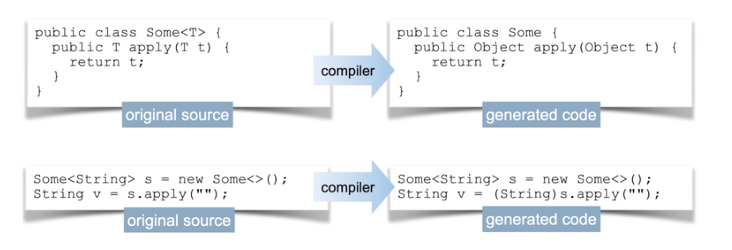
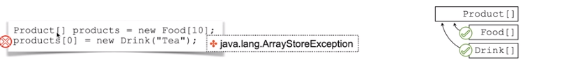
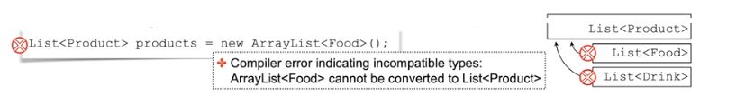
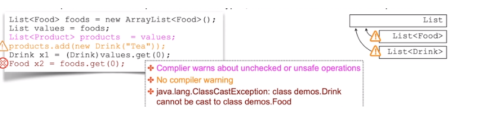

# Advanced Generics
## Compiler Erases Information About Generics
Generics information can be erased from the compiled code
- Compiler verifies type-safety of your code before erasing generics
- Compiler adds relevant type-casting operations



## Generic and Raw Type Compatibility
When applying generics to override methods;
- Compiler verifies type-safatey of your code before erasing generics
- Adds a synthetic (compiler generated) bridge method
- **Bridge method compiles with the** **non-generics** **signature of the method that your code is overriding** (created for backward compatibility reasons)
- **Bridge method invokes your non-synthetic method, applying type-casting to the generic type**
	- No type-casting nneds to be applied to the code that invokes such an operation


## Generics and Type Hierarchy
Generics are **invariant** to **enforce compile time verification of types**
- Java arrays are **covariant** which can result in **runtime executions**


- Collection API uses generucs that are **invariant** code is validated at **compile time**


- **Generics compiler checks are not performed for raw types**, which can result in runtime exceptions


## Wildcard Generics
**Generics are used to enforce compile-time verification of type**
Generics re often used with Collection API. Consider the follwing collections examples:
- When **generics are not applied**, code defaults to use type Object
	- Only `Object` class operation can be safely uused
	- Type-check and type-casting must be applied to access any sub-type specific operations
- When **specific type is applied**:
	- any operation declared for this type or its parents can be safely used
	- type-check and type casting must be applied to access any sub-type specific operations
- When wildcard `<?>` is applied (representing an unknown type):
	- Elements are accessed just like in a collection of `Objects`
	- Effectively it is a read-only collection
	- no object in java is of unknown type, so no values (except null) can be added to such a collection
```java
// add, remove and manipulate instances of Object class or its descendants
List listOfAnyObjt1 = new ArrayList();
List<Objects> ListOfAnyObjt2 = new ArrayList<>();

// add, remove and manipulate instances of Product class or its descendants
List<Product> listOfProdct = new ArrayList<>();

//Nothing could be added to this list, except null
List<?> listOfUnknownType = listOfProducsts;

```