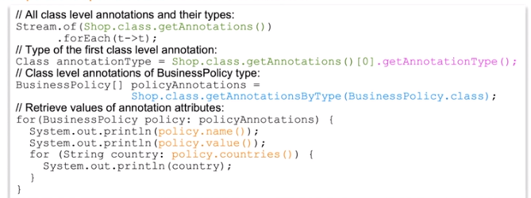
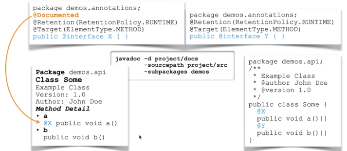
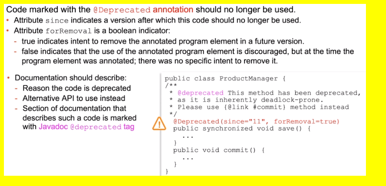
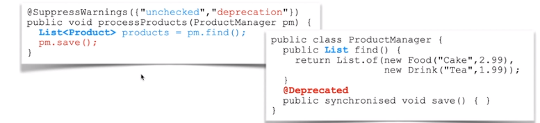
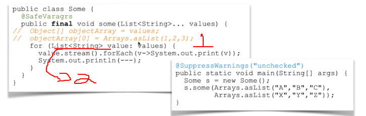

# Java Annotations

## Introduction to Annotations
- provide information about a program that is not part of the program itself.
- can be retained at different levels:
  - `SOURCE` is retained in the source code, but discarded by the compiler
  - `CLASS` is retained by the compiler, but ignored by JVM
  - `RUNTIME` is retained by the JVM and readable at run time.
- applicable to different type of targets:


## Design Annotations
- annotations can have **attributes**
- attributes could be of the following types
	- primitive
	- String
	- Class
	- Enum
	- Annotation
	- an array of any of the above
- attribute can have a **default value**, which could be a constant expression
- attribute can be an array of values, including other repeatable annotations
- repeatable annotations is allowed to be used more than once within a given container

```java
@Retention(RetentionPolicy.RUNTIME)
@Target(ElementType.TYPE)
public @interface BusinessPolicies {
	BusinessPolicy[] value();
}
```
```java
@Retention(RetentionPolicy.RUNTIME)
@Target(ElementType.TYPE)
public @interface BusinessPolicy {
	String name() default "default policy"
	String[] contries();
	String value();
}
```

## Apply Annotations
- Attributes are set as a list of name-values pairs `@Annotation(name=value, arrayName={e1,e1})`
- when no attributes are used, `( )` can be omitted
- attributes `value` does not have to be specified by name, **when it's the only attribute that needs to be set**
- if array has only one value, `{ }` can be ommited
- attribute with default values can be omitted

```java
@BusinessPolicies({
	@BusinessPolicy(name="Returns Policy", contries="GB", value="3 weeks")
	@BusinessPolicy( contries={"GB", "FR"}, value="Ship via dover-calais")
})
public class Shop { }
```

## Dynamically Discover Annotations
Java reflection API allows dynamic discovery of class structures, including annotations
- **Get array of annotations for the class**, methods, or fields 
- discover annotation type
- get annotations by type
- invoke operations upon annotation to retrive its attributes



**Get all method-level annotations**
```
Stream.of(Shop.class.getMethods())
.flatMap(m -> Stream.of(m.getDeclaredAnnotations()))
.flatMap(a -> sout(a));
```

**Get all field-level annotations**
```
Stream.of(Shop.class.getFields())
.flatMap(f -> Stream.of(f.getDeclaredAnnotations()))
.flatMap(a -> sout(a));
```

## Document the Use of Annotations
Annotation can be marked with the @Documented annotation
- Class documentation would include a reference to annotations that are marked as documented


## Annotations that Validate Design
Annotation may be used to validate class or interface design
- enforce the definition of a functional interface
	- only one abstract method should be present in a functional interface
	- The `@FunctionalInterface` annotation rpevents interface from compiling if this rule is broken

- verify that a method actually overrides a parent operation
	- subclass must match the signature of the parent class method
	- the `@Override` annotation prevents subclass from compiling if this rule is broken

## Deprecated Annotation


## Suppress Compiler Warning
Indicate that compiler warning should be suppressed for the annotated element.
- warning can be suppressed on a class or specific method level
- unchecked warnings are caused by assignment of **raw-type** object to **generic-type** variable
- deprecated warnings are caused by the use of out-of-date APIs


- compiler is unable to perform type safety check on the raw object.
- In the above example, method `find` return a **raw** type of `List` with Objects of type `Food` and `Drink`. When invoking method `find` the compiler will give a **warning** and  suppressing compiler warnings could be dangerous.

## Var-args and Heap Pollution
incorrect use of var-args with generics can lead to heap pollution
- var-arg essentially an array, so it can be assigned to an array of object (arrays are covariant)
- Array of objects allows adding of elements that are not of a type expected by a generic declaration
- `ClassCastException` may occur when trying to get elements from the collection

Annotation `@SafeVarargs` suppresses heap-pollution warning when using var-args
- ensure that your code does not produce actual healp pollution
- annotated method must be `private` or `final` to maintain type safety guarantee.


1. If something like (1) happens (adding an array of a different type)
2. when we do like (2) an exception is thrown
3. but the compiler, in order to help, give us a warning about a possible problem like (1) and (2)
4. if we are sure that there will be no operations like (1), we can use the annotation  `@SafeVarargs` to turn off the compile warning.