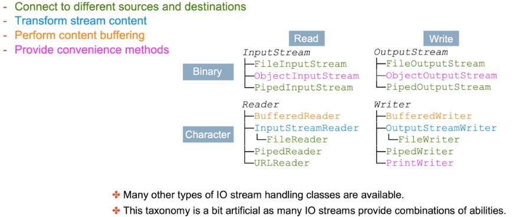
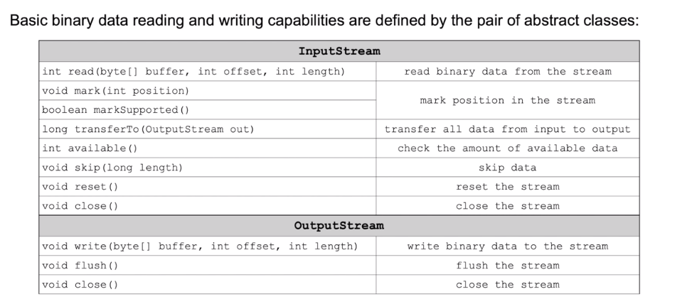
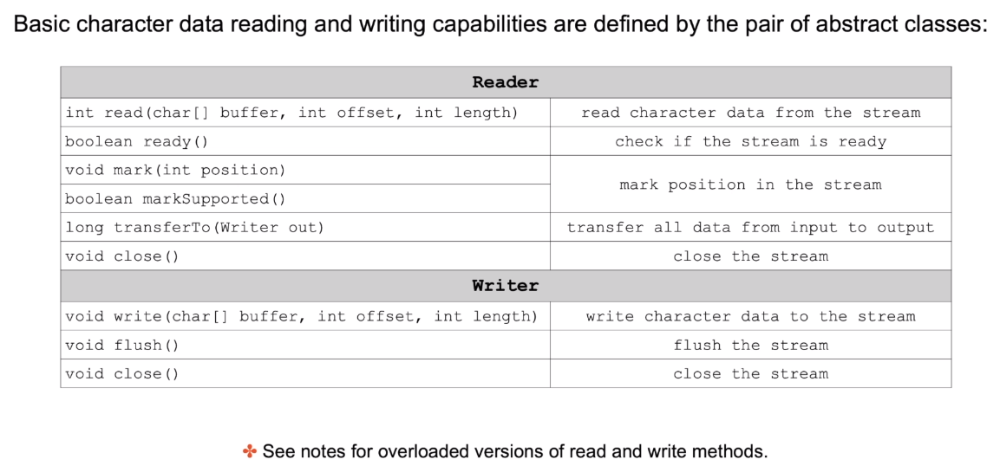
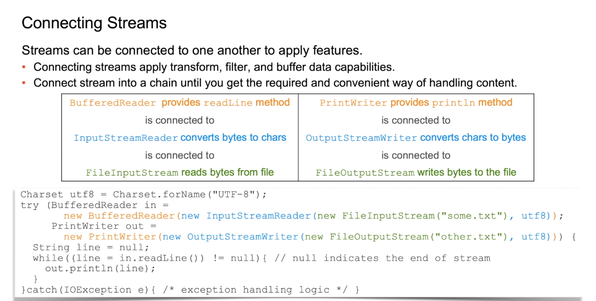
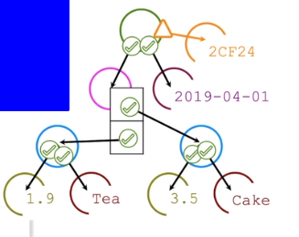
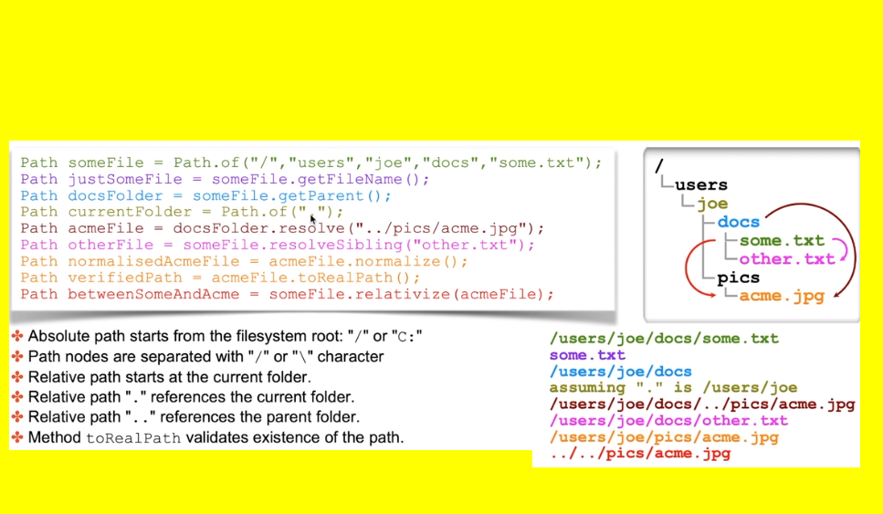
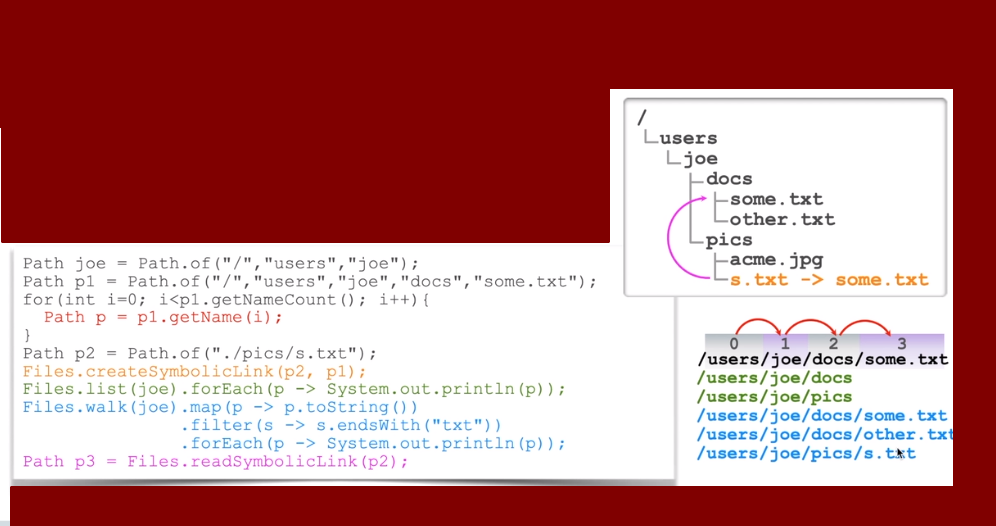

# Java IO API
## Java Input-Output principals
**Characteristics of java Input-Output (IO)**
- Read information from various sources - input direction
- Write information to various destinations - output direction
- Information is transfered through a series of interconnected **streams** (pipes)

**Streams are categorized based on**
- The type of data that stream can carry, for example, text or binary
- Direction of the stream - input or output
- Type of the source or destination to which this stream is connected
- Stream can apply additional handling by filtering or transformation of data 

## Java Input-Output API
**IO classes are located in java.io and java.nio packages**
- Abstract classes define general text binary data read and write abitlities
- Concrete classes descend from these parents to provide different tyoes of IO streams handlers
	- connect to different sources and destunations
	- transform stream content
	- perform content buffering
	- provide convenience methods



## Reading and Writing Binary Data
 

### Basic Binary Data Reading and Writing 
**Basic Binary Data Reading and Writing capabilities are provided by Input and Output streams**
- input and output streams both implement `AutoCloseable` interface
	- can be used in the try-with-parameters construct
	- closed within the implicit finally block
	- otherwise must be closed explicitly with the final block
- method `read` populates the buffer with portions of binary data and returns an int `lenght` indicator
	- on intermediate reads, this indicator is equal to how much data remains in the stream
	- on the last read, it equals to -1, which indicates the end of the stream

```java
try(InputStream in = new FileInputStream("some.xyz");
	OutputStrem out = new FileOutputStrem("other.xyz");) {
	byte [] buffer = new byte[1024];
	int lenght = 0;
	while((length = in.read(buffer)) !=-1){
		out.write(buffer, 0, length);
	}
 } catch(IOException e { 
	 // exception handling logic
 }
```

### Basic Reading and Writing Character Data

```java
Charset utf8 = Charset.forName("UTF-8");
try(Reader in = new FileReader("some.xyz", utf8);
	Writer out = new FileWriter("other.xyz", utf8);) {
	byte [] buffer = new byte[1024];
	int lenght = 0;
	while((length = in.read(buffer)) !=-1){
		out.write(buffer, 0, length);
	}
 } catch(IOException e { 
	 // exception handling logic
 }
```

## Connectiong Streams


## Serialization
**Serialization Purpose**
- Serialization is a process of writing objects from memory into a stream
- Deserialization is a process of reading objects from the stream
- Data is serialized in a binary form

**Serialization use cases**
- Swapping objects to avoid running out of memory
- Sending objects across network
	- replicate data between nodes in a cluster
	- pass parameters and return values when calling methods remotely
- Serialization is not a suitable solutin for long-term data storage
	- Serialized value is specific to the complied code version. What if you change your class? The serialized shape is not compatible with the new shape, so that means that the data previusly saved will not match with the new version of the code any longer.

### Serializable Object Graph
An Object can be written to or be read from a stream.
- `java.io.Serializable` interface is used to indicate **permission to serialize instances of a class**
- You **can serialize all primitives as well as many other classes such as strings, numberns, dates, and collections**
- Serialization includes the entire object graph, except for **transient variables**
- `SerializationException` is produced upon an attempt to serialize a non-transient variable that is of non-serializable type

```java
public class PriceList implements Serializable {
	private LocalDate date;
	private Set<Product> items =  new HashSet<>;
	private transient String hash = generateHash();
}

public class Product implements Serializable {
	private String name;
	private BigDecimal price;
}

PriceList list = new PriceList(LocalDate.now());
list.addItem(new Dring("Tea", 1.9));
list.addItem(new Food("Cake", 1.9));
```



### Object Serialization
Java IO provides classes to read and write objects in and out of streams
- `ObjectOutputStream` writes serializable object to a stream
- `ObjectInputStream` reads serializable object frfom a stream

```java
try(ObjectOutputStream out = new ObjectOutputStream(new FileOutputStream("swap"))) {
	out.writeObject(list);
	list = null;
} catch(IOException e) {
	// log the exception
}

try(ObjectInputStrem out = new ObjectInputStrem("swap"))){
	list= (PriceList) in.readObject();
} catch (...) {// ...}
 catch (...) {// ...}
 catch (...) {// ...}
```

### Customize Serialization Process
Serialization-Deserialization processes can be customized
- method `writeObject` performs custom actions when serializing this object
- method `readObject` performs custom actions when deserializing this object
- note that these methods must use **private** access modifiers
- Invocation of `defaultWriteObject` and `defaultReadObject` methods allows normal operations

```java
public class Product implements Serializable {
	private String name;
	private BigDecimal price;
	private transient byte[] hash = new byte[32];
	
	private void writeObject (ObjectOutputStream out) throws IOException{
		out.defaultWriteObject();
		out.writeObject(Instant());
	}
	
	private void readObject (ObjectInputStream out) throws IOException, ClassNotFoundException{
		out.defaultReadObject();
		hash = generateHash(); // Recalculate transient values. These are values that are not serialized with the object
	}
}
```

### Serialization and Versioning
When designing Serializable classes, consider the class life cycle
- Serialization is not a suitable solution for long-term data storage;
- a modified class definition is produced when
	- source code is changed
	- class is recompiled with a different version of JDK
- Mismatch of the class definition could result in unpredictable program behavior
- `ObjectInputStream` checks the `serialVersionUID` indicator to ensure that the class definition you are using is the same as the class definition used by Java runtime at the time when the object was serialized and throws an `InvalidClassException` in case of a mismatch

```java
public class Product implements Serializable {
	private static final long serialVersionUID = 1L;

}
```

## Working with Filesystems
Package `java.nio.file` contains classes that handle filesystem interactions
- Class `Path` represents **files** and **folders**
- Class `Files` provides **operations** that **handler path objects**
- Class `FileSystem` describes available filesystems and their properties
	- Access properties of file stores using a stream of FileStore objects
	- Discover filesystem roots using a stream of Path object "/" or "C:" etc;
	- Get path node separator for the given OS "/" or "\"

**Extra information**
- Class `java.io.File` is legacy API class whose functionalities are now distribuited between `Path, Files` and `FileSystem` classes of a new IO API.
- Operation `toFile()` of the `Path` class converts path object to file object
- Operation `toPath()` of the `File` class converts file object to path object

### Constructing Filesystem Paths
Class `Path` represents files and folders as **immutable objects**
- a `var-arg` method `of` constructs new path object 
	- Ex: `Path.of("/","users","augusto","myFile.txt")`
- `Path` objects may represent an absolute or a relative path (can convert between path representations)
- You may create non-existent path objects without causing exceptions until you try to use them

```
Path currentFolder = Path.of(".") // assuming "." is /users/augusto
Path otherFile
```




### Navigating the Filesystem
Class `Files` provides operations that handle path objects
- `Path` objects can be represented as a **sequence of path elements**
- Class `Files` provides operations to navigate the filesystem
	- List folder content `Files.list(myPathObject)` (return a stream)
	- Walk down filesystem path `Files.walk(myPathObject)` (return a stream)
- Symbolic links represent "Shortcuts" to other paths `Files.createSymbolicLink(myPathObjectThatPointsToSecondParam, myPathObjectThatIsPointedByFirstParam)`
- Class `Files` can create and read symbolic links

    
