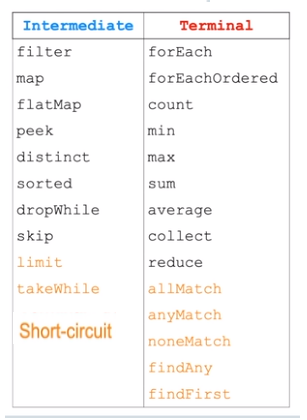
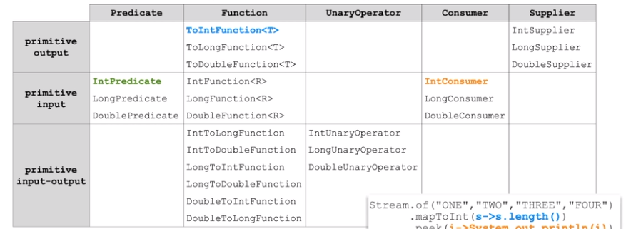
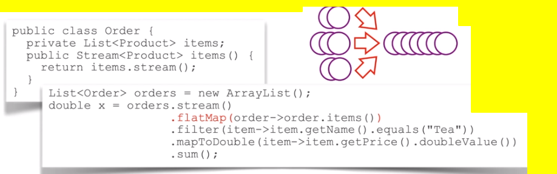

# Java Streams API

## Characteristics of Streams
- **Stream is an immutable flow of elements**
- Stream processing can be **sequencial** or **parallel**
- once an elements is processed, it is no longer available from the stream
- stream pipeline traversal uses **method chaining** - intermediate operations return streams
- pipeline traversal is **lazy**
	- **intermediate actions are deferred until stream is traversed by the `terminal` operation**
	- the chain of activities could be fused into a single pass on data
	- stream processing ends as soon as the result is determined; remaining stream data can be ignored
- streams operations use functional interfaces and can be implemented as **lambda expressions**

## Create Streams Using Stream API
- Streams handling is described by the following interfaces:
	- The `BaseStreams` -  defines core streams behaviors, such as managig the stream in a parallel or sequential mode
	- `Stream, DoubleStream, IntStream, LongStream` interfaces extend the `BaseStream` and provide stream processing operations
	- Streams use generics
	- to avoid **excessive boxing and unboxing**, primitive stream variants are also provided (move from stack to the heap all the time)
	- Stream can be obtained from any `collection and array` or by using static methods of the `Stream` class

```java
IntStream.generate(() -> (int) (Math.random()*10)).takeWhile(n -> n !=3 ).sum();
// Will generate random value until number 3 happens
// Stream handling operations categories: Short-circuit

Stream.of(new Food(), new Drink()).forEach(p -> p.setPrice(1));

Arrays.stream(array).filter(...).forEach(...)
```

## Stream Pipeline Processing Operations
- Stream handling operations categories:
	- `Intermediate` - Perform actions and **produce another stream**
	- `Terminal` - Traverse stream pipeline and end the stream processing
	- `Short-circuit` - produces finite result, even if presented with infinite input



- `peek` vs `forEach` : the difference etween them is that `peek` is a **intermediate** operation and produces a **stream as a result** while `forEach` is a **terminal** operation

## Using Functional Interfaces

- Basic functions purposes
	- `Predicate<T>` performs tests
		- defines method `boolean test(T t)` to apply conditions to filter elements
	- `Functions<T,R>` converts types
		- defines method ` R apply (T t)` to convert types of elements
	- `UnaryOperator<T>` converts values
		- defines method `T apply (T t)` to convert values
	- `Consumer<T>` processes elements
		- `void accept (T t)` to process elements
	- `Supplier` produces elements
		- defines method `T get()` to produces elements


```java
Stream.generate(<supplier>)
	.filter(<Predicate>)
	.peek(<consumer>)
	.map(<Function>/<UnaryOperator>)
	.forEach(<Consumer>)
```

## Primitive Variants of Functional Interfaces
- improve stream pipeline handlin performance by avoiding excessive auto-boxing-unboxing


- `ToIntFunction<T>`: takes an object and return a primitive (in this case `int`)
- `IntFunction<R>`: creates objects out of primitives
- `IntToLongFunction`: stream of primitive to stream of primitives of different types
- `IntPredicate`: apply the condition to a primitive
- `IntSupplier`: produces intergers 

## Bi-Argument Variants of Functional Interfaces
- process more than one value at a time
- extra parameter is provided compared to basic function interfaces
	- `BiPredicate<T,U>` defines method `boolean test(T t, U u)` to apply conditions
	- `BiFunction<T, U, R>` defines methods `R apply (T t, U u)` to convert two types into a single result
	- `BinaryOperator<T>` defines method `T apply (T t1, T t2)`  to convert two values
	- `BiConsumer<T>` defines method `void accept (T t, U u)` to process a pair of elements 


```
Map<Product, Integer> items = ...;
items.forEach((p,q) -> p.getPrice().multiply(BigDecimal.valueOf(q.intValue())));
```

## Perform Actions with Stream Pipeline Elements
- Intermediate or terminal actions are handled by **peek** and **forEach**
- Operations `peek, forEach, and forEachOrdered` accept Consumer<T> interface
- Lambda expression must implement abstract `void accept(T t)` method
- Default  `andThen` method provided by the `consumer` interface combines concumers together.
- Differencec between `forEachOrdered` and `forEach` is that the last one does not guarantee respecting the order of elements, which is actually beneficial for parallel stream processing.

**Example**
```java
Consumer<Product> expireProduct = (p) -> p.setBestBefore(...)
Consumer<Product> discountProduct = (p) -> p.setDiscount(...)

list.stream().forEach(expireProduct.andThen(discountProduct));

list.stream()
	.peek(expireProduct).
	.filter(p.getPrice().compareTo(...) > 0)
	.forEach(discountProduct);
```

## Perform Filtering of Stream Pipeline Elements
- method `filter` accepts `Predicate<T>` interface and teturns a stream comprising only elements that satisfy the filter criteria
- lambda expression must implement abstract method `boolean test (T t)`
- default methods provided by the `Predicate`:
  - `and` ~ &&
  - `or` ~ || 
  - `negate` returns a predicate that represents the logical negation of this predicate
- Static methods provided by the `Predicate` interface
  - `not` returns a predicate that is the negation of the supplied predicate
  - `isEqual` returns a predicate that compares the supplied object with the contents of the collection

```java
Consumer<Product> discountProduct = (p) -> p.setDiscount(...)
Predicate<Product> foodFilter = (p) -> p istanceof Food;
Predicate<Product> priceFilter = (p) -> p.getPricec().compareTo(...) < 0;

list.stream()
		.filter(foodFilter.negate().or(priceFilter))
		..forEach(discountProduct);

list.stream()
	.peek(expireProduct).
	.filter(p.getPrice().compareTo(...) > 0)
	.forEach(discountProduct);
```

## Perform Mapping of Stream Pipeline Elements
- Map stream elements to a new stream of different content type using `map` operation
- Method `map` accepts a `Function<T,R>` interface and returns a new stream comprising elements produced by this function based on the original stream content
- lambda impmenets `R apply (T t)` method
- default methods provided by the function:
  - `andThen` and `compose` combine functions together
  - `compose` does the exact same thing in the oposite direction of the method `andThen`
- Static methods provided by the `Function` interface
  - `identity` returns a function that always returns its input argument (equivalent of t->t function).
- Primitive variants of map are: `mapToInt`, `mapToLong`, etc.

```java
Function<Product, String> nameMapper = (p) -> p.getName();
UnaryOperator<String> trimMapper = n -> n.trim();
ToIntFunction(String) lengthMapper = n -> n.lenght();

list.stream()
		.map(nameMapper.andThen(trimMapper))
		.mapToInt(lenghtMapper)
		.sum();
```

## Join Streams Using `flatMap` Operation
- Flatten a number of streams into a singleStream
- Operation `Stream<R>` flatMap `(Function<T, Stream<R>> f)` merges streams
- primitive variantes are: `flatMapToInt, flatMapToLong`, etc.



## Aggregate Stream Data using `reduce` Operation
- Produce a **single** result from the stream of values using reduce operation.
- `Optional<T> reduce(BinaryOperator<T> accumulator)` performs accumulation of elements
- `T reduce(T identity, BinaryOperator<T> accumulator)` performs accumulation of elements and has a initial (default) value
- `<U> U reduce(U identity,  BiFunction<U,T,U> accumulator BinaryOperator<U> combiner)` BiFunction performs both value mapping and accumulation of values. BinaryOperator combines results produced by the BiFunction in parallel stream handling mode.

```java
list.stream()
	.parallel()
	.reduce("", (s,p)-> p.getName()+ " " + s, (s1,s2) -> s1 + s2)
	// reduction with initial (default) value and a parallel combiner
```

## General Logical of the `collection` Operation
- perform a mutable reduction operation on the elements of the stream
- method `collect` accepts Collector interface implementation, which:
  - Produces new result containers using `Supplier`
  - Accumulates data elements into these result containers using `BiConsumer` 
  - Combines result containers using `BinaryOperator`
  - Optionally performs a final transform of the processing result using the `Function`
- Class `Collectors` presents a number of predefined implementations of the `Collector` interface

```
stream.collect(<supplier>, <accumulator>, <combiner>)
```