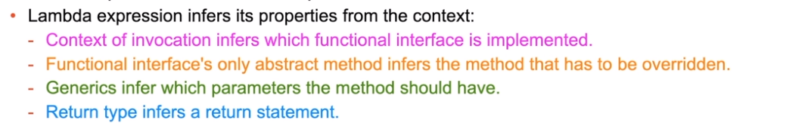
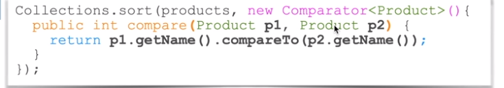

# Nested Classes and Lambda Expressions

Classes can be defined inside other classes to encapsulate logic and constrain context of use.

**Why Nested Classes?**

> Usually, you would like to probably do kind of a more reusable code. So introduce a code with a greater degree of usability. But occasionally, you may wish to design some code that is intentionally restrictive in a way it is reused so you don't want the code to be reused everywhere. You want that particular class to only be used in a certain context.

* Type of the nested class depends on the context in which it is used
  * **static nested class** is associated with the **static context** of the outer class
  * **member inner class** is associated with the **instance context** of the outer class
  * **local inner class** is associated with the **context of specific method**
    * Outer method local variables and parameters can only be accessed if they are **final or effectively final**
  * **anonymous inner class** is an inline implementation or extension of an interface or a class
  * Static and member of nested classes can be defined as
    * `public, protected or default` - can be accessed externally
    * `private` - can be referenced only inside their outer class

## Anonymous Inner Class

**Anonymous inner class** is an inline implementation or extension of an interface or a class.

* Extend a parent class or implement an interface to override operations
* Implemented inline and instantiated immediately
* Outer method local variables and parameters can only be accessed if they are **final** or **effectively final**

```java
Order order =  new Order() {
	@Override
	public BigDecimal getDiscount() {
		return BigDecimal.valueOf(0.1);
	}
};
```

## Anonymous Inner Classes and Functional Interfaces

Anonymous Inner Classes are typically used to provide inline interface implementations.

* Anonymous inner class can implement an interface inline and override as many methods as required
* **Functional Interfaces** define only one abstract method that must be overridden
* Anonymous inner classes that implements functional interface will only have to override one method
* It could be more convenient to:
  * Use a regular class to override many methods
  * Use anonymous inner class to override a few methods (just one in case of a functional interface)

```
	List<Product> products = ... 
	Collections.sort(products, new Comparator<Product>()){
		public int compare(Product p1, Product p2){
			return p1.getName().compareTo(pe.getName()));	
		}
	}
```

## Understand Lambda Expressions

Lambda expression is an inline implementation of a functional interface.  

## Define Lambda Expression Parameters and Body

* Parameter definitions of lambda expressions
  * To apply modifiers (`final String s`) (annotations or keywords) to parameters, define them using:
    * specific types `(final String s`
    * locally inferred types `(final var s)`
    *   Ex:

        ```
        List<String> lsit = new ArrayList<>();
        list.removeIf((final String s) -> s.equals.("remove me"))
        list.removeIf((final var s) -> s.equals.("remove me"))
        ```
  *   when no modifier is required, you may just infer types from the context

      ```
      List<String> lsit = new ArrayList<>();
      list.sort((s1,s2) -> {return s1.compareTo(s2);};)
      ```
  * formal body `{ }` and `return` statements are optional when using a simple expression
  * round brackets for parameters are also optional
  * expressions cab be **predefiend and reused**

## Using Method References

lambda expressions may use method referencing.

* **reference method is **_**semantically**_** identical to the method that lambda expression is implementing**
* `<Class>::<staticMethod>`
* `<object>::<instanceMethod>`
* `<Class>::<instanceMethod>`
* `<Class>::new`

## Default and Static Methods in Functional Interfaces

Interfaces may provide additional non-abstract methods

* lambda expression implements the only **abstract method** provided by the functional interface
* `default` and `static` methods may be defined by the interface to provide additional features
* `private` methods could be present, but they are not visible outside of the interface.
* There is no requirement to override default methods unless there is a conflict between different interfacecs that a given class implements
* lambda expressions cannot cause shuch conflicts, because each one is an inline implementation exactly one interface

### Use `Default` and `Static` methods of the `Comparator` interface

* Examples of default methods provided by the `java.util.Comparator` interface:
* `thenComparing` adds additional **comparators**
* `reversed` reverses sorting order

Examples of static methods provided by the comparator interface:

* `nullFirst` and `nullsLast` return **comparators** that enable sorting collections with null values.

```
// new Food ("Cake", BigDecimal.valueOf(1.99));
Comparator<Product> sortNames = (p1,p2) -> p1.getName().compareTo(p2.getName());

Comparator<Product> sortPrices = (p1,p2) -> p1.getPrice().compareTo(p2.getPrice());

Collections.sort(myProdCollection, sortNames.thenComparing(sortPrices).reversed());
```

### Use `Default` and `Static` Methods of the `Predicate` interface

The `default` methods provided by the `java.util.function.Predicate` interface:

* `and` combines `predicates` like the `&&` operator
* `or` combines `predicates` like the `||` operator
* `negate` returns a `predicate` that represents the logical negation of this predicate The `static` methods provided by the `Predicate` interfacec:
* `not` returns `predicate` that is the negation of the supplied `predicate`
* `isEqual` returns a `predicate` that compares the supplied object with the contents of the collections.

```
// creating a predicate for negation
        Predicate<Integer> even = i -> i % 2 == 0;
  
        // creating a predicate object which
        // is negation os supplied predicate
        Predicate<Integer> odd = Predicate.not(even);
  
        // filtering the even number using even predicate
        List<Integer> evenNumbers
            = list.stream().filter(even).collect(
                Collectors.toList());
  
        // filtering the odd number using odd predicate
        List<Integer> oddNumbers
            = list.stream().filter(odd).collect(
                Collectors.toList());
```
